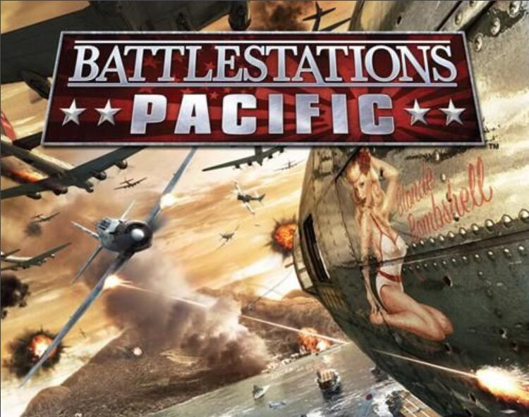

# B. Battlestations Pacific

| 时间限制 | 空间限制 |
| :------: | :------: |
| 1000 ms  |  64 MB   |

## 题目描述

海战，是二战中最具浪漫色彩的部分之一，也是二战史中最为闪光的一个篇章。作为忠实的海战迷，SRC 最大的乐趣就是在 Battlestations Pacific 这款游戏中还原历史战役的情景。~~（SRC：历史梗天下第一！）~~ 

在海战历史上，有这么一场神奇的战役，我们值得一谈。指挥官 Mr. Kidding 拥有一个很大的舰队，和一个不靠谱的传令官。这场战役最神奇的地方，就在 Kidding 指挥官的战列编排上。

我们的 Kidding 指挥官有两种舰群：巡洋舰（Cruisers，使用 C 表示）和驱逐舰（Destroyer，使用 D 表示）。一开始，Kidding 的战列只有一艘驱逐舰。然后，Kidding 指挥官使用如下办法布置他的战列：

- 按当前战列配置一组完全相同的舰队；
- 把新战列的每一艘船对换，也就是说，如果当前战列某个位置的船只为巡洋舰，那就换成驱逐舰，反之亦然；
- 然后，再把新战列的顺序翻转。比如，原来是 `DDC`， 翻转过后就变成了 `CDD`。
- 最后，把新的战列阵容拼在之前的战列之后。

当然，这样配置的舰队还不够安全，所以 Kidding 指挥官还会在两个战列之间添加一艘驱逐舰（`D`）保证两个战列的安全。Kidding 指挥官会进行多轮这样的操作，直到他觉得当前战列足够令人满意为止。

我们用字符串来表示的话，Kidding 的战列变化历程是如下样子的：
$$
\begin{aligned}
S_1&=\text{D}\\
S_2&=\text{DDC}\\
S_3&=\text{DDCDDCC}\\
\cdots
\end{aligned}
$$
现在，你已经知道 Kidding 指挥官是如何配置战列的了，现在就该不靠谱的传令官出场了！排列战列是一项很频繁的举动，Kidding 指挥官总是下各种指令，而我们优秀的传令官总是会在各条指令间辗转，终于——Kidding 指挥官有了一个 $S_{J}$ 状态的战列阵容！Whoa！什么，你问 $J$ 是什么？当然是 `Joke` 常数啦！顺带一提，$J=233^{233} $。

天道好轮回，苍天饶过谁。这么大的舰队，可怜的传令官根本算不清楚哪里是什么船，而 Kidding 指挥官的命令还在不断下达。SRC 看不过去了，准备帮助这位可怜的传令官给 Kidding 指挥官答案。

*毕竟，SRC 在游戏中，就是控制着 Kidding 指挥官 :)*

## 输入格式

输入包含多行。

第一行为一个整数 $T(1\le T\le 23333)$，代表测试用例的组数。

接下来的 $T$ 行，每一行包含一个整数 $K(1\le K\le 2.33\times 10^{18})$，表示 Kidding 指挥官想要询问的位置。

## 输出格式

对于每一个测试用例，在新的一行中输出对应位置的舰船类型。巡洋舰为 `Cruisers`， 驱逐舰为 `Destroyer`。

## 样例

<table>
    <tr>
        <th style="text-align:center">标准输入流</th>
        <th style="text-align:center">标准输出流</th>
    </tr>
    <tr>
        <td>3 2 6 14</td>
        <td style="vertical-align:top">Destroyer Cruisers Cruisers
</td>
    </tr>
</table>

## 提示

考虑前 20 艘船：`DDCDDCCDDDCCDCCDDDCD……`，可以看出第 14 艘船是巡洋舰。

~~这场战役并不存在。~~

