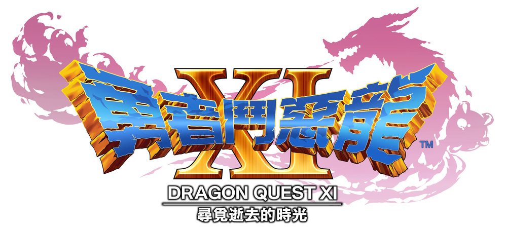

# D. Dragon Quest

| 时间限制 | 空间限制 |
| :------: | :------: |
| 1000 ms  |  64 MB   |

## 题目描述

RPG，Role Playing Game，我们所熟悉的角色扮演游戏。这个世界上有许多十分知名的 RPG 游戏，而熟悉 RPG 的玩家，一定会听说过勇者斗恶龙这个传奇的游戏系列。黄金三人组的开发阵容，永远不变的幻想故事，历久弥新的回合制战斗，是这个游戏仍然有如此多拥趸的秘诀。

你是勇者斗恶龙系列的粉丝，现在正在玩最新的《勇者斗恶龙11》。由于你带错了装备，所以当前你的小队如果直接攻击这个 BOSS，每回合只能造成 $1$ 的伤害。不过，你有一个技能，可以给这个 BOSS 一次性造成 $K$ 的伤害。这个技能的副作用是，这个角色在下一回合会变得暂时不可用，必须等一个回合才能继续使用。由于这个 BOSS 血量充足，你很快就败下阵来。你翻了翻攻略，如果需要找到能够给这个 BOSS 一定伤害的武器，你需要做一系列支线任务——不仅枯燥，而且需要很长的时间。所以你想硬干，当然，无谋的硬干只是浪费时间，所以你想知道，有多少种不同的方法打败当前 BOSS？

举例来说，假如技能伤害为 $3$ ，那么攻击一个血量为 $4$ 的 BOSS 有以下三种方法：

1. 连续直接攻击 BOSS。
2. 先直接攻击一次 BOSS，然后使用一次技能。
3. 先使用一次技能，在下一个回合由于技能不可用，所以你直接攻击 BOSS。

注意，这个 BOSS 还有另一个技能，就是如果你当前造成的伤害超过了 BOSS 的生命值，他会把多出来的这部分反馈到你身上，所以，你只考虑**正好**击败 BOSS 的方法。

我们定义两种攻击方式中，假如有任何一个时刻你所使用的战斗方法不同，这两种攻击方式就是不同的。

由于答案可能会很大，你只需要输出对 $2^{64}$ 取模后的结果即可。取模运算在 C/C++/Java 里面使用 `%` 操作符。

## 输入格式

输入包含多行。

第一行为一个整数 $T(1\le T\le 233)​$，代表测试用例的组数。

接下来的 $T$ 行，每行包含两个整数 $K_i, D_i$，分别代表技能的攻击力和 BOSS 的血量。

数据范围满足 $1\le D_i\le 10^5, 2\le K_i\le10^5,1\le i\le T$。

## 输出格式

对于每个测试用例，在新的一行中输出正好击败 BOSS 的方法数对 $2^{64}$ 取余的结果。

## 样例

<table>
    <tr>
        <th style="text-align:center">标准输入流</th>
        <th style="text-align:center">标准输出流</th>
    </tr>
    <tr>
        <td>3 3 4 3 6 11 23</td>
        <td style="vertical-align:top">3 5 15</td>
    </tr>
</table>

## 提示

如果你不知道如何把结果对 $2^{64}$ 取余的话，请你使用 `unsigned long long` 来保存中间变量和结果，在自然溢出的状态下就是对 $2^{64}$ 取模。