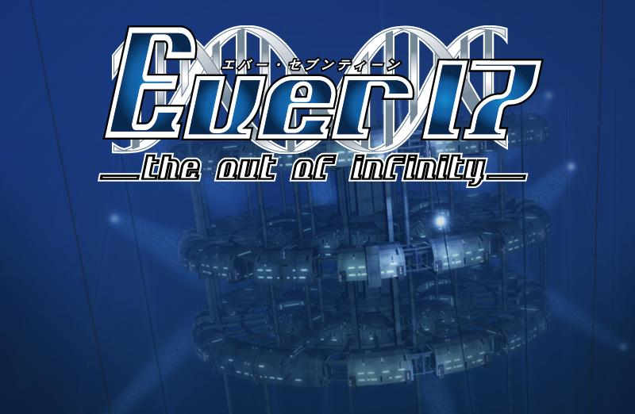

# E. Ever17 -the out of infinity-

| 时间限制 | 空间限制 |
| :------: | :------: |
| 1000 ms  |  64 MB   |

## 题目背景

如果说世界上有什么不可思议的话，你应该是确实遇到了：你只是来新开的水下游乐园 LeMU 享受难得的周末，为什么就被困在了这里？

等到回过神来，你发现你自己站在了一扇密码门前。你想起来了，你们一行人在被困后找到了一个据点，商量好对策之后，你的任务是尽可能去远处探索，找一下有什么补给，或者有没有什么逃生的手段。毕竟，距离 LeMU 崩坏，只剩下不到 60 个小时了。

你定了定神，看了看这扇门。这扇门和乐园的氛围格格不入——倒不如说，这扇门更应该出现在医院或者实验室之类的地方。你定睛一看，门的密码键盘上面有这么一张纸条，似乎是粗心的研究人员用于提醒自己密码是什么而写的：

> 求下面多项式的所有零点：
> $$
> f(x)=P_N\cdot x^N+P_{N-1}\cdot x^{N-1}+\cdots+P_1\cdot x^1+P_0\cdot x^0
> $$
>

当你即将开始计算的时候，小町鸫（游戏女主角之一）指了指下面，你看到了另一句话：

> 该多项式的运算优先级翻转。也就是说，加法 $+$ 优先级最高，乘法 $\cdot, \times$ 次之，乘幂运算 $x^k$ 最低。
>
> 例如，$a^b+c\cdot d=a^{(b+c)\cdot d}$。特别的，$0^0=1$。

你傻傻的笑了一下，刚让她对你的好感度上升，这里却不能露怯。只是，这扇门背后到底隐藏了什么？一想到这里，你计算速度就开始变慢。想让这种和谐的时光变得更长，甚至，要不就多呆一会儿？反正距离 LeMU 崩坏还剩五十几个小时……

“你到底在干什么？” “啊哈哈……” 思绪被她的一声质问拉了回来。不管门背后是什么，你都要为了未来而前进！你加快了手上的计算，答案就快出来了，不能让她再多等了，也不能让大家再多等了！

*但是，这次事件背后所隐藏着的真相，远超过你的想象。我是指，正在玩这个游戏的**你**。*

## 输入格式

输入包含多行。

第一行为一个整数 $T(1\le T\le 233)$，代表测试用例的组数。

接下来有 $2T$ 行，每两行按如下格式给出一个测试用例：

第一行为一个整数 $N(0\le N\le 233)$，代表这个多项式的项数。

接下来的一行有 $N+1$ 个整数 $|P_i|\le 233,0\le i\le N$，代表这个多项式第 $i$ 项的系数，即系数按照 $x$ 升幂顺序给出。我们保证 $P_{N}\ne 0$。

## 输出格式

对于每个测试用例，在第一行中输出解的个数。如果有无穷多个解，请输出`INF`，如果没有解，请输出 $0$。

如果有解且有有限个解，则在接下来的一行中按**任意**顺序输出所有的解，用空格分隔。

如果解的个数正确，同时每个解与正确答案之间的绝对误差或者相对误差在$10^{-6}$以内，都会被认为是正确的。我们保证只有实数解。

## 样例

<table>
    <tr>
        <th style="text-align:center">标准输入流</th>
        <th style="text-align:center">标准输出流</th>
    </tr>
    <tr>
        <td>3 1 1 1 4 9 0 -6 2 -2 0 19</td>
        <td style="vertical-align:top">1 0.0 0 0</td>
    </tr>
</table>
## 提示

这个例子也许能帮助你理解题目中的运算优先级：$-2^{-3}\times-1+ -2=-2^{(-3\times(-1+-2))}=-2^9=-512$。

如果对运算优先级仍有问题，请通过 Clarification 提问。

第二个多项式为：
$$
f(x)=(-2)x^4+2x^3+(-6)x^2+0x^1+9x^0
$$
按照题意展开，发现此式无零点。