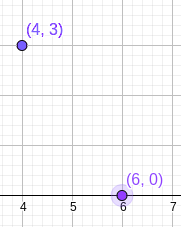
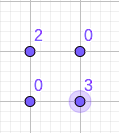

# F. Fire Emblem

| 时间限制 | 空间限制 |
| :------: | :------: |
| 8000 ms  |  384 MB  |

## 题目描述

如果要提到战棋类游戏，火焰纹章（Fire Emblem）系列一定是不得不提的。

让我来简单描述一下游戏规则吧。游戏的规则很简单，你有一些可操作单位和一些敌人在一个矩形网格上，每个单位的装备啊，可移动范围啊等等都不同。双方按回合轮流移动各自单位，每个单位都有自己的移动规则，一旦到达规则限制了本回合就不能再移动了。你要在本队不被全灭 / 重要单位不被击败等限制条件下，完成击败掉全部敌人或者防御限定回合等要求。

有一点不得不提：一个单位的移动方向只能是上下左右。换句话说，一个单位在网格上的移动路径都是由有限条直线组成的。对于任意两个单位来说，由于我们只能上下左右移动，所以这两个单位的距离是**曼哈顿距离**。

> 两个单位的曼哈顿距离是什么？简单来说，对于两个点 $(x_1,y_1), (x_2,y_2)$，他们的曼哈顿距离 $D_m=|x_1-x_2| + |y_1-y_2|$。
>
> 比如，下图的两个点对的曼哈顿距离为 $5$。
>
> 

那么，两个单位的最短曼哈顿距离越大，意味着我可能需要更多的回合才能让两个单位尽可能靠近，他们互相支援的难度也就越大。让我们来考虑一个问题：对于你现有的单位来说，互相支援的难度有多大？

让我把问题形式化描述一下：假设当前你有一张 $N\times N$ 大小的正方形地图，每一格都有一些单位 $C$。那么，我知道的问题其实是：假设两个单位之间没有阻碍，可以随意移动，那么对于所有的两个单位来说，他们之间的最短曼哈顿距离是多少？当然，这样的问题太大了，而且并无益处，所以我只想知道，对于我任意选择的两个单位，有多少种可能的曼哈顿距离？每种可能的曼哈顿距离又有多少对？

可以相信的是，如果能解出这个问题，你就能成为火焰纹章的高玩。事不宜迟，赶快行动吧！

## 输入格式

输入包含多行。

第一行为一个整数 $N(1\le N\le 1024)$，代表网格图的大小。

接下来有 $N$ 行，每行有 $N$ 个数字，按如下形式给出：
$$
\begin{matrix}
C_{1,1} &\cdots &C_{1,N}\\
\vdots &\ddots &\vdots\\
C_{N,1} &\cdots &C_{N,N}\\
\end{matrix}
$$
$C_{i,j}$ 代表在 $(i,j)$ 的位置有 $C_{i,j}$ 个单位， $0\le C_{i,j}\le 10, \forall i,j, 1\le i,j\le N$。

## 输出格式

输出包含多行。

第一行为一个整数 $K$，代表有 $K$ 种距离。

接下来的 $K$ 行，每行各两个整数 $D_i, Q_i(1\le i\le K)$，代表距离为 $D_i$ 的点对有 $Q_i$ 对。

请按 $D_i$ 由上到下升序的顺序输出。

## 样例

<table>
    <tr>
        <th style="text-align:center">标准输入流</th>
        <th style="text-align:center">标准输出流</th>
    </tr>
    <tr>
        <td>2 2 0 0 3</td>
        <td>2 0 4 2 6</td>
    </tr>
    <tr>
        <td style="vertical-align:top">3 1 2 3 4 5 6 7 8 9</td>
        <td>5 0 120 1 340 2 340 3 160 4 30</td>
    </tr>
</table>

## 提示

对于样例一来说，我们有如下两种距离：

- $D_1 = 0$，在位置 $(1,1)$ 的有 $C_2^2=1$ 对，在位置 $(2,2)$ 有 $C_3^2=3$ 对，共有 $1+3=4$ 对。
- $D_2=2$，我们可以选择任意一个 $(1,1)$ 的单位和任意一个 $(2,2)$ 的单位配对，所以答案是 $2\times 3=6$。

下面的图片可能帮助你更好的理解：

